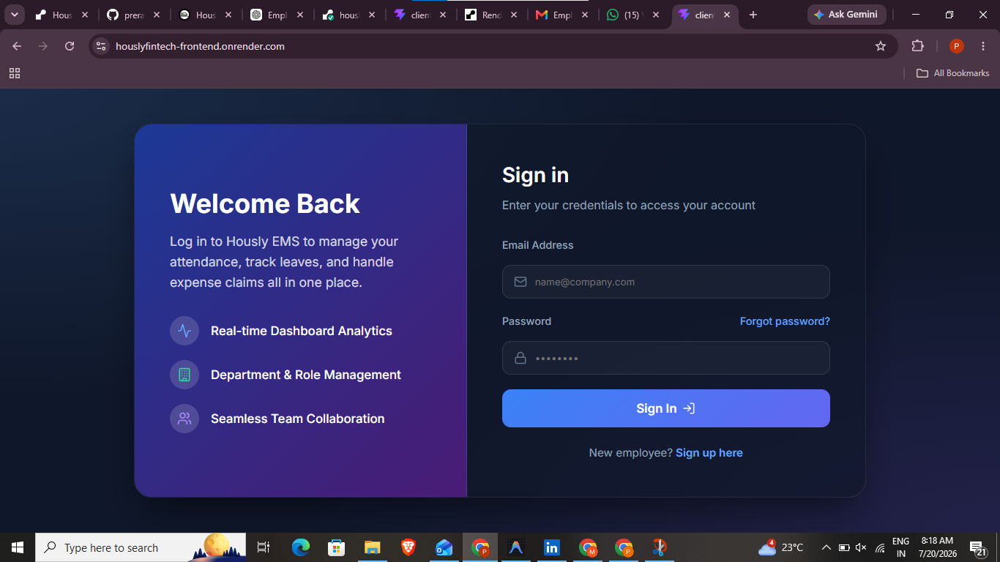
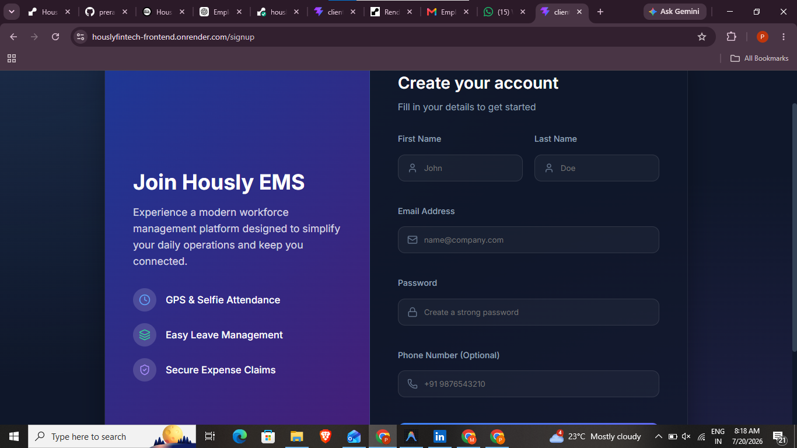
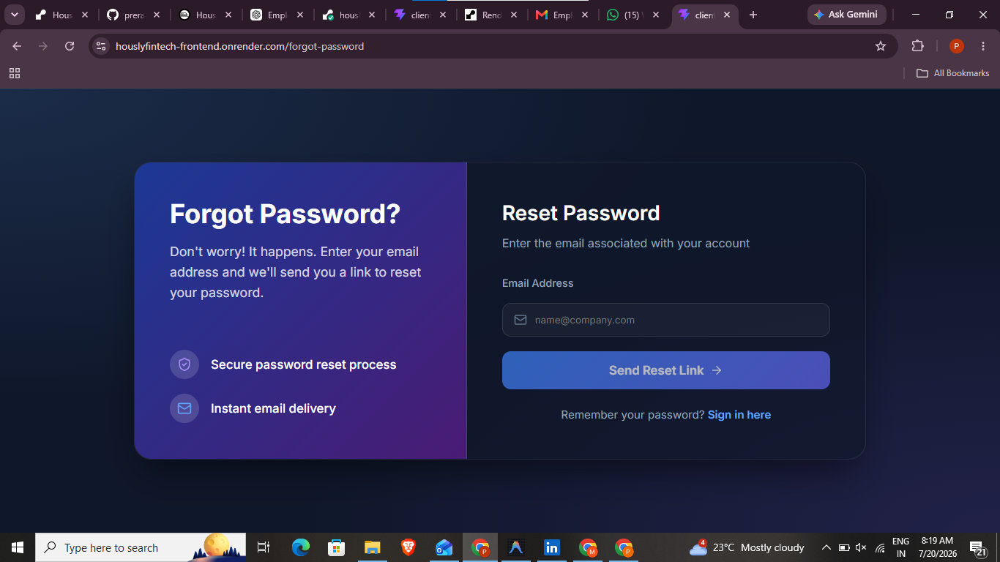
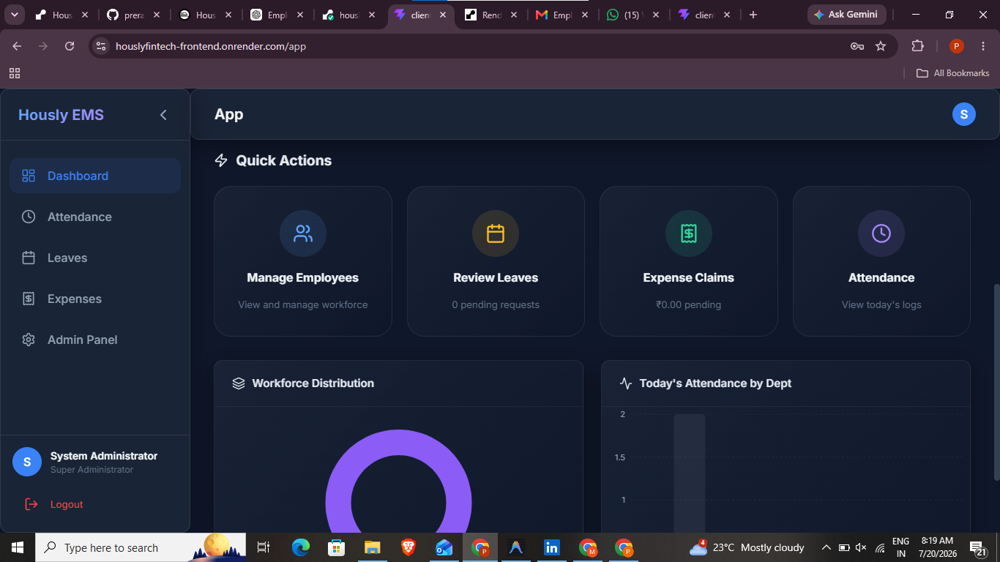
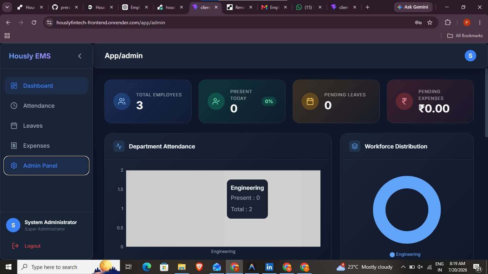
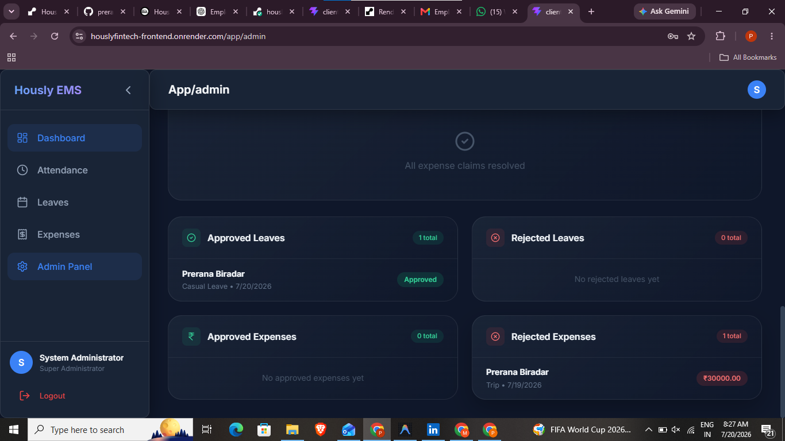

# Employee Management System

<p align="center">
  
  
  
  
  
</p>

## 📌 Project Overview

The **Employee Management System** is a full-stack web application designed to streamline employee operations within an organization. It provides secure authentication, role-based access control, attendance tracking using **selfie verification and location coordinates**, leave management, and expense management.

The application includes **separate dashboards for Admin and Employees**, ensuring users only access features based on their assigned roles and permissions.

---

## 🚀 Live Demo

**Application URL**

👉 https://houslyfintech-frontend.onrender.com/

---

# ✨ Features

## 👨‍💼 Employee Dashboard

- Secure Login & Authentication
- Dashboard Overview
- Selfie-Based Attendance
- GPS Location Coordinate Attendance
- Check In / Check Out
- Attendance History
- Apply Leave
- View Leave Status
- Submit Expense Claims
- Expense History
- Profile Management

---

## 👨‍💻 Admin Dashboard

- Dashboard Analytics
- Employee Management
- Attendance Monitoring
- Leave Approval & Rejection
- Expense Approval & Rejection
- Department Management
- Role Management
- User Management
- Reports & Records
- Access Control

---

# 📂 Modules

## ✅ Attendance Management

Features:

- Selfie Capture
- Latitude & Longitude Verification
- Check In
- Check Out
- Attendance History
- Attendance Status

---

## ✅ Leave Management

Features:

- Apply Leave
- Leave History
- Leave Approval Workflow
- Leave Status Tracking

---

## ✅ Expense Management

Features:

- Add Expense
- Upload Bills
- Expense Categories
- Approval Workflow
- Expense History

---

## ✅ Role & Department Management

Features:

- Department Creation
- Employee Assignment
- Role Assignment
- Permission Based Access
- Admin/User Separation

---

# 🛠 Technology Stack

## Frontend

- React JS
- HTML5
- CSS3
- JavaScript
- Axios
- React Router

## Backend

- Node JS
- Express JS

## Database

- MySQL

## Authentication

- JWT Authentication
- Protected Routes
- Role Based Authorization

## Deployment

| Service | Platform |
|----------|----------|
| Frontend | Render |
| Backend | Railway |
| Database | MySQL |

---

# 📸 Screenshots


```
screenshots/login.png
```



---


```
screenshots/admin-dashboard.png
```



---

## Employee Dashboard

```
screenshots/user-dashboard.png
```



---


```
screenshots/attendance.png
```



---


```
screenshots/leave-management.png
```



---


```
screenshots/expense-management.png
```


---


```
screenshots/department-management.png
```



---

```
screenshots/role-management.png
```


---

# 📁 Project Structure

```
Employee-Management-System
│
├── client
│   ├── src
│   ├── public
│   └── package.json
│
├── server
│   ├── controllers
│   ├── middleware
│   ├── routes
│   ├── models
│   ├── uploads
│   └── server.js
│
├── screenshots
├── README.md
└── package.json
```

---

# ⚙ Installation

## Clone Repository

```bash
git clone https://github.com/yourusername/Employee-Management-System.git
```

---

## Install Frontend

```bash
cd client
npm install
npm run dev
```

---

## Install Backend

```bash
cd server
npm install
npm start
```

---

# Environment Variables

Create a `.env` file inside the server folder.

```env
PORT=5000

DB_HOST=localhost
DB_USER=root
DB_PASSWORD=yourpassword
DB_NAME=employee_management

JWT_SECRET=your_secret_key
```

---

# Security Features

- JWT Authentication
- Password Encryption
- Protected Routes
- Role Based Authorization
- Department Based Access
- Secure API Validation


---

# 👨‍💻 Author

**Prerana Biradar**

Full Stack Developer


---

## ⭐ If you found this project helpful, don't forget to give it a Star!
